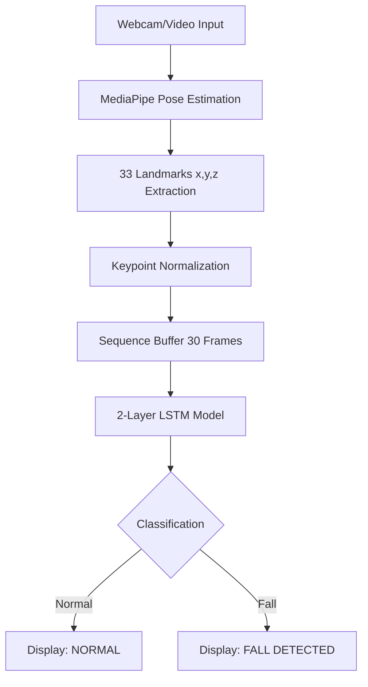

# 🚨 Real-Time Fall Detection System

[](https://www.python.org/downloads/)
[](https://pytorch.org/)
[](https://mediapipe.dev/)
[](https://opencv.org/)

A sophisticated, real-time fall detection system leveraging **Human Pose Estimation** and **Recursive Neural Networks (LSTM)**. By analyzing temporal motion patterns from skeletal keypoints, the system accurately distinguishes between everyday activities and sudden fall events.

---

## 📸 Overview

This project uses **MediaPipe Pose** to extract 33 skeletal landmarks in real-time. These spatial-temporal features are processed through a **2-layer LSTM** network trained to recognize the specific dynamics of a falling motion.

### 🔄 System Architecture



---

## ✨ Key Features

- **⚡ Real-Time Inference**: Optimized for live webcam feeds using MediaPipe's efficient pose estimation.
- **🧠 Advanced LSTM Architecture**: Captures the temporal progression of movements, offering higher accuracy than static frame analysis.
- **⚖️ Weighted Learning**: Optimized CrossEntropyLoss to handle dataset imbalance and prioritize fall recall.
- **🛠️ Dual-Mode Operation**: Single script for both model training and real-time demonstration.
- **📊 Performance Visualization**: Built-in confusion matrix and classification report generation after training.

---

## 🛠️ Tech Stack

| Component | Technology |
| :--- | :--- |
| **Deep Learning** | PyTorch, LSTM |
| **Pose Estimation** | Google MediaPipe |
| **Computer Vision** | OpenCV |
| **Data Processing**| NumPy, Scikit-learn |

---

## 🚀 Getting Started

### 1. Prerequisites
- Python 3.8 or higher
- A webcam for the real-time 

### 2. Installation

```bash
# Clone the repository
git clone https://github.com/ManavSharma23/fall-detection.git
cd fall-detection

# Set up virtual environment
python -m venv venv
source venv/bin/activate  # Windows: venv\Scripts\activate

# Install dependencies
pip install -r requirements.txt
```

### 3. Usage

Run the main application:
```bash
python Main.py
```

You will be presented with a prompt:
- `1`: **Train Model** - Processes videos in `dataset/` (`fall` and `normal` subfolders) to train a new `fall_model.pth`.
- `2`: **Run Demo** - Starts the webcam for real-time fall monitoring using the pre-trained model.

---

## 📐 Methodology Deep-Dive

### Data Pipeline
1. **Pose Extraction**: 33 keypoints (x, y, z) = 99 features per frame.
2. **Normalization**: Each sequence is normalized by its mean and standard deviation to ensure coordinate-invariant detection.
3. **Temporal Windowing**: A sliding window of **30 frames** (approx. 1 second at 30fps) is used as input for the LSTM.

### Model Specs
- **Input Size**: 99 (33 joints * 3 coordinates)
- **Hidden Layers**: 2 x 128 LSTM units
- **Dropout**: 0.3 for robust generalization
- **Class Weights**: 1.3x weight on Fall events to minimize false negatives

---

## 🔮 Future Roadmap

### 🤖 Advanced AI
- **GCN Integration**: Implement Spatial Temporal Graph Convolutional Networks for better joint-relationship modeling.
- **XAI Support**: Add feature importance maps to visualize which joints triggered the detection.

### 📱 Deployment & Hardware
- **Edge Deployment**: Optimize for Raspberry Pi 4 and Jetson Nano using **ONNX/TensorRT**.
- **Mobile App**: Cross-platform monitoring app built with Flutter.

### 🚨 Connectivity
- **Cloud Alerts**: Firebase integration for remote monitoring.
- **Emergency SMS**: Automated alerts via Twilio API when a fall persists.

---

## 📄 License
This project is licensed under the MIT License - see the [LICENSE](LICENSE) file for details.

---
*Created with ❤️ for college project showcase.*
